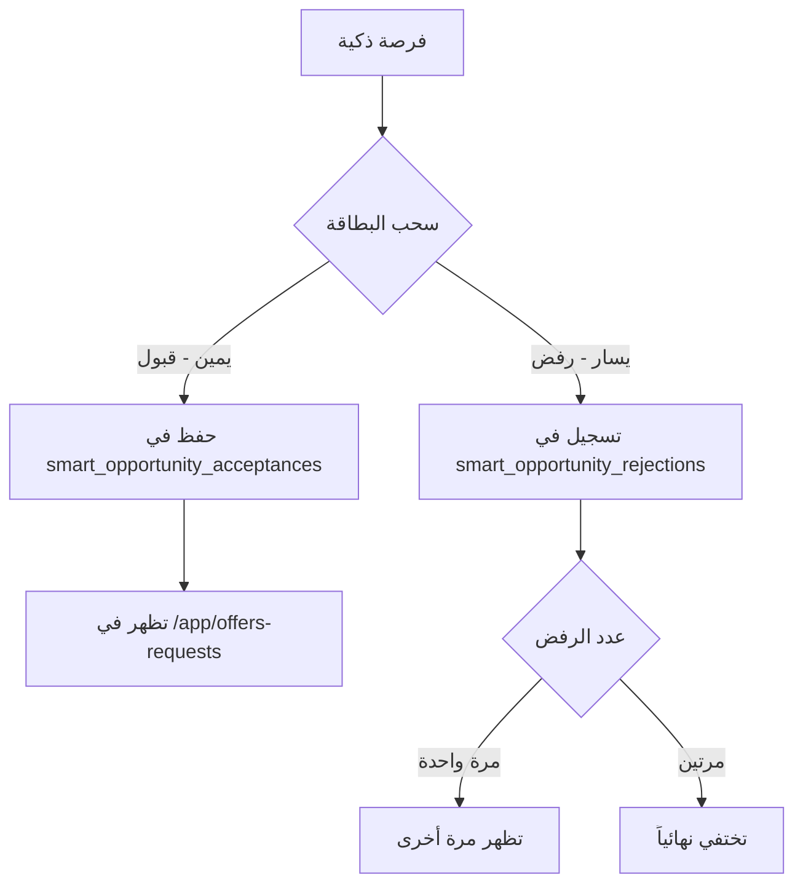
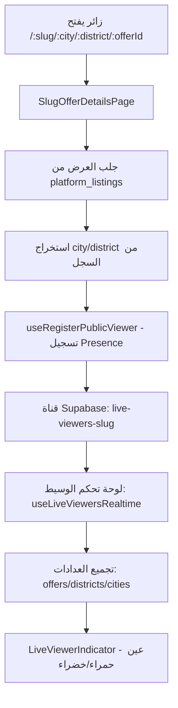

# ⚠️ الروابط والملفات المحمية - لا تعدل بدون إذن

هذا المستند يوثق الروابط والملفات المحمية التي يجب عدم تعديلها بدون موافقة صريحة من المستخدم.

## الروابط المحمية

### 1. روابط نشر العقار
```
صفحة نشر العقار ← تبويب العروض (منصتي) ← تبويب المنصة ← صفحة المشاركة العامة
```
- الملفات: `PropertyPublishForm.tsx`, `MyPlatformComplete.tsx`, `SlugPlatformPage.tsx`

### 2. الربط مع إدارة العملاء
```
صفحة نشر الإعلان ← إنشاء بطاقة عميل ← التبويبات الخاصة بالتفاصيل
```
- الملفات: `PropertyPublishForm.tsx`, `EnhancedBrokerCRM.tsx`, `CustomerDetailsPage.tsx`

### 3. أزرار بطاقة الأعمال الرقمية
| الزر | الصفحة العامة | الملف |
|------|--------------|-------|
| إرسال عرض | `/:slug/offer` | `SlugOfferPage.tsx` |
| إرسال طلب | `/:slug/request` | `SlugRequestPage.tsx` |
| إنشاء موعد | `/:slug/calendar` | `SlugCalendarPage.tsx` |
| عرض سعر | `/:slug/quote` | `SlugQuotePage.tsx` |

### 4. روابط المواعيد
| الرابط | الغرض | الملف |
|--------|-------|-------|
| `/:slug/appointmentapproval/broker/:appointmentId` | تأكيد حضور الوسيط | `SlugAppointmentApprovalBroker.tsx` |
| `/:slug/appointmentapproval/approval/:appointmentId` | نفس السابق (بديل) | `SlugAppointmentApprovalBroker.tsx` |
| `/:slug/appointmentapproval/customer/:appointmentId` | تأكيد حضور العميل | `SlugAppointmentApprovalCustomer.tsx` |
| `/:slug/appointmentapproval/sorry` | صفحة الاعتذار وإعادة الجدولة | `SlugAppointmentApprovalSorry.tsx` |

### 5. الفرص الذكية
| الرابط | الغرض |
|--------|-------|
| `/app/smart-opportunities` | صفحة الفرص الذكية |
| `/app/offers-requests` | صفحة العروض والطلبات المقبولة |

### 6. ⭐ روابط المنصة العامة الهرمية (محمية بشكل صارم)
| الرابط | الغرض | الملف |
|--------|-------|-------|
| `wasataai.com/:slug` | الصفحة الرئيسية للمنصة العامة | `SlugPlatformPage.tsx` |
| `wasataai.com/:slug/:city/:district/:offerId` | صفحة تفاصيل العرض العامة | `SlugOfferDetailsPage.tsx` |

**⚠️ سلوك الرجوع المحمي:**
- زر الرجوع/الإغلاق من صفحة العرض يعود دائماً إلى `/{slug}` (الصفحة الرئيسية)
- لا يعود لمستوى المدينة أو الحي

### 7. ⭐ نظام المشاهدات المباشرة (Real-time Presence)
| المستوى | المكون | الوظيفة |
|---------|--------|---------|
| المدينة | `getCityViewers(cityName)` | إجمالي المشاهدين في جميع عروض المدينة |
| الحي | `getDistrictViewers(city, district)` | إجمالي المشاهدين في جميع عروض الحي |
| العرض | `getOfferViewers(offerId)` | المشاهدين على العرض المحدد |

**الملفات المحمية:**
- `src/hooks/useLiveViewersRealtime.ts` - منطق Presence الأساسي
- `src/components/ui/LiveViewerIndicator.tsx` - مكون العين الحمراء/الخضراء
- `src/pages/SlugOfferDetailsPage.tsx` - تسجيل الزائر + استخدام presenceCity/presenceDistrict من DB

**⚠️ قواعد التطبيع المحمية:**
- `normalizeKeyPart()` - توحيد المسافات وإزالة التشكيل
- `normalizeDistrictName()` - إزالة "حي " للتطابق
- الزائر يُسجل بـ `city` و `district` من سجل العرض في DB (وليس من URL)

## آلية عمل الفرص الذكية



## آلية عمل المشاهدات المباشرة



## الملفات المحمية

### ملفات الروابط
- `src/App.tsx` - تعريف جميع الـ Routes
- `src/utils/slugify.ts` - بناء الروابط

### ⭐ ملفات المشاهدات المباشرة (محمية بشكل صارم)
- `src/hooks/useLiveViewersRealtime.ts` - منطق Presence + تطبيع المفاتيح
- `src/components/ui/LiveViewerIndicator.tsx` - مؤشر العين
- `src/pages/SlugOfferDetailsPage.tsx` - تسجيل الزائر

### ⭐ ملفات المنصة العامة (محمية بشكل صارم)
- `src/pages/SlugPlatformPage.tsx` - الصفحة الرئيسية
- `src/pages/SlugOfferDetailsPage.tsx` - تفاصيل العرض + سلوك الرجوع

### ملفات الفرص الذكية
- `src/pages/SmartOpportunitiesPage.tsx`
- `src/pages/OffersRequestsPage.tsx`
- `src/hooks/useSmartOpportunities.ts`
- `src/components/smart-opportunities/SwipeableOpportunityCard.tsx`
- `src/components/smart-opportunities/AcceptedOpportunityCard.tsx`
- `src/data/mockSmartOpportunities.ts`

### ملفات المواعيد
- `src/pages/SlugAppointmentApprovalBroker.tsx`
- `src/pages/SlugAppointmentApprovalCustomer.tsx`
- `src/pages/SlugAppointmentApprovalSorry.tsx`

### ملفات البطاقة الرقمية
- `src/pages/SlugOfferPage.tsx`
- `src/pages/SlugRequestPage.tsx`
- `src/pages/SlugQuotePage.tsx`
- `src/pages/SlugCalendarPage.tsx`

## قواعد الحماية

1. **🚫 لا تعديل بدون إذن** - أي تغيير يتطلب موافقة صريحة بالعربية أولاً
2. **📝 التوثيق قبل التعديل** - يجب توضيح سبب التعديل بالعربي والانتظار للموافقة
3. **🔗 الحفاظ على الروابط** - أي تغيير في مسار الرابط يكسر الروابط المشاركة سابقاً
4. **✅ اختبار بعد التعديل** - التأكد من عمل جميع الروابط بعد أي تغيير
5. **👁️ حماية نظام المشاهدات** - لا تعديل على منطق Presence أو التطبيع بدون إذن
6. **↩️ حماية سلوك الرجوع** - الرجوع من العرض يعود لـ `/{slug}` فقط

---

**آخر تحديث:** 2026-02-02
**سبب التحديث:** حماية روابط المنصة العامة الهرمية ونظام المشاهدات المباشرة وسلوك الرجوع
