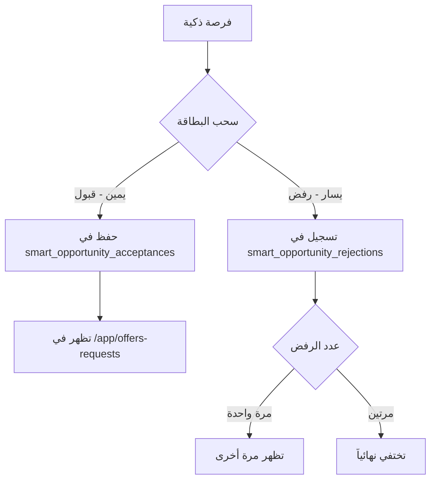

# ⚠️ الروابط والملفات المحمية - لا تعدل بدون إذن

هذا المستند يوثق الروابط والملفات المحمية التي يجب عدم تعديلها بدون موافقة صريحة من المستخدم.

## الروابط المحمية

### 1. روابط نشر العقار
```
صفحة نشر العقار ← تبويب العروض (منصتي) ← تبويب المنصة ← صفحة المشاركة العامة
```
- الملفات: `PropertyPublishForm.tsx`, `MyPlatformComplete.tsx`, `SlugPlatformPage.tsx`

### 2. الربط مع إدارة العملاء
```
صفحة نشر الإعلان ← إنشاء بطاقة عميل ← التبويبات الخاصة بالتفاصيل
```
- الملفات: `PropertyPublishForm.tsx`, `EnhancedBrokerCRM.tsx`, `CustomerDetailsPage.tsx`

### 3. أزرار بطاقة الأعمال الرقمية
| الزر | الصفحة العامة | الملف |
|------|--------------|-------|
| إرسال عرض | `/:slug/offer` | `SlugOfferPage.tsx` |
| إرسال طلب | `/:slug/request` | `SlugRequestPage.tsx` |
| إنشاء موعد | `/:slug/calendar` | `SlugCalendarPage.tsx` |
| عرض سعر | `/:slug/quote` | `SlugQuotePage.tsx` |

### 4. روابط المواعيد
| الرابط | الغرض | الملف |
|--------|-------|-------|
| `/:slug/appointmentapproval/broker/:appointmentId` | تأكيد حضور الوسيط | `SlugAppointmentApprovalBroker.tsx` |
| `/:slug/appointmentapproval/approval/:appointmentId` | نفس السابق (بديل) | `SlugAppointmentApprovalBroker.tsx` |
| `/:slug/appointmentapproval/customer/:appointmentId` | تأكيد حضور العميل | `SlugAppointmentApprovalCustomer.tsx` |
| `/:slug/appointmentapproval/sorry` | صفحة الاعتذار وإعادة الجدولة | `SlugAppointmentApprovalSorry.tsx` |

### 5. الفرص الذكية
| الرابط | الغرض |
|--------|-------|
| `/app/smart-opportunities` | صفحة الفرص الذكية |
| `/app/offers-requests` | صفحة العروض والطلبات المقبولة |

## آلية عمل الفرص الذكية



## الملفات المحمية

### ملفات الروابط
- `src/App.tsx` - تعريف جميع الـ Routes
- `src/utils/slugify.ts` - بناء الروابط

### ملفات الفرص الذكية
- `src/pages/SmartOpportunitiesPage.tsx`
- `src/pages/OffersRequestsPage.tsx`
- `src/hooks/useSmartOpportunities.ts`
- `src/components/smart-opportunities/SwipeableOpportunityCard.tsx`
- `src/components/smart-opportunities/AcceptedOpportunityCard.tsx`
- `src/data/mockSmartOpportunities.ts`

### ملفات المواعيد
- `src/pages/SlugAppointmentApprovalBroker.tsx`
- `src/pages/SlugAppointmentApprovalCustomer.tsx`
- `src/pages/SlugAppointmentApprovalSorry.tsx`

### ملفات البطاقة الرقمية
- `src/pages/SlugOfferPage.tsx`
- `src/pages/SlugRequestPage.tsx`
- `src/pages/SlugQuotePage.tsx`
- `src/pages/SlugCalendarPage.tsx`

## قواعد الحماية

1. **لا تعديل بدون إذن** - أي تغيير يتطلب موافقة صريحة
2. **التوثيق قبل التعديل** - يجب توضيح سبب التعديل بالعربي
3. **الحفاظ على الروابط** - أي تغيير في مسار الرابط يكسر الروابط المشاركة سابقاً
4. **اختبار بعد التعديل** - التأكد من عمل جميع الروابط بعد أي تغيير
