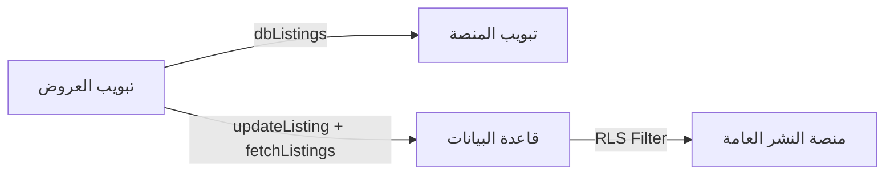

# ⚠️ الروابط والملفات المحمية - لا تعدل بدون إذن

هذا المستند يوثق الروابط والملفات المحمية التي يجب عدم تعديلها بدون موافقة صريحة من المستخدم.

---

## 🔒 القسم الأول: تبويب العروض (محمي بشكل صارم)

### الوظائف المحمية
| الوظيفة | الوصف | الملف |
|---------|-------|-------|
| `toggleOfferVisibility()` | إخفاء/إظهار العرض | `MyPlatformComplete.tsx` |
| `handleDeleteOffer()` | حذف العرض (Soft Delete) | `MyPlatformComplete.tsx` |
| `cityHierarchy` | الهيكل الهرمي (مدينة ← حي ← عرض) | `MyPlatformComplete.tsx` |
| `dbListings` | العروض من قاعدة البيانات | `usePlatformListings.ts` |

### الملفات المحمية
- `src/components/platform/MyPlatformComplete.tsx` - تبويب العروض الكامل
- `src/hooks/usePlatformListings.ts` - جلب/تحديث العروض من DB
- `src/components/offers/OfferActionsMenu.tsx` - قائمة إجراءات العرض

---

## 🔒 القسم الثاني: تبويب المنصة (محمي بشكل صارم)

### الوظائف المحمية
| الوظيفة | الوصف |
|---------|-------|
| عرض العروض الظاهرة فقط | فلتر `status=published && isHidden=false` |
| التزامن مع تبويب العروض | استخدام `ownerListingsFromParent` من المكون الأب |
| بناء الهيكل الهرمي | `buildHierarchy()` لعرض المدن والأحياء |

### الملفات المحمية
- `src/components/platform/MyPublicPlatformContent.tsx` - معاينة المنصة للمالك
- `src/components/platform/MyPlatformComplete.tsx` - تمرير `dbListings` كـ `ownerListingsFromParent`

---

## 🔒 القسم الثالث: منصة النشر العامة (محمي بشكل صارم)

### الروابط المحمية
| الرابط | الغرض | الملف |
|--------|-------|-------|
| `wasataai.com/:slug` | الصفحة الرئيسية للمنصة العامة | `SlugPlatformPage.tsx` |
| `wasataai.com/:slug/:city/:district/:offerId` | صفحة تفاصيل العرض | `SlugOfferDetailsPage.tsx` |

### سياسات RLS المحمية (قاعدة البيانات)
```sql
-- الزوار يرون فقط العروض المنشورة والظاهرة
Policy: "Public can view published listings"
USING: (status = 'published' AND is_hidden = false)

-- المالك يرى جميع عروضه
Policy: "Users can view their own listings"
USING: (auth.uid() = user_id)
```

### سلوك الرجوع المحمي
- زر الرجوع/الإغلاق من صفحة العرض يعود دائماً إلى `/{slug}`
- لا يعود لمستوى المدينة أو الحي

### الملفات المحمية
- `src/pages/SlugPlatformPage.tsx` - الصفحة الرئيسية العامة
- `src/pages/SlugOfferDetailsPage.tsx` - تفاصيل العرض + سلوك الرجوع

---

## 🔒 القسم الرابع: نظام المشاهدات المباشرة (محمي بشكل صارم)

### المستويات المحمية
| المستوى | الدالة | الوظيفة |
|---------|--------|---------|
| المدينة | `getCityViewers(cityName)` | إجمالي المشاهدين في المدينة |
| الحي | `getDistrictViewers(city, district)` | إجمالي المشاهدين في الحي |
| العرض | `getOfferViewers(offerId)` | المشاهدين على العرض المحدد |

### قواعد التطبيع المحمية
- `normalizeKeyPart()` - توحيد المسافات وإزالة التشكيل
- `normalizeDistrictName()` - إزالة "حي " للتطابق
- الزائر يُسجل بـ `city` و `district` من سجل العرض في DB

### الملفات المحمية
- `src/hooks/useLiveViewersRealtime.ts` - منطق Presence + تطبيع المفاتيح
- `src/components/ui/LiveViewerIndicator.tsx` - مؤشر العين الحمراء/الخضراء

---

## 🔒 القسم الخامس: التزامن بين التبويبات (محمي)

### آلية العمل المحمية


### القواعد المحمية
1. عند إخفاء عرض من تبويب العروض → يتم تحديث `is_hidden=true` في DB
2. تبويب المنصة يعرض فقط العروض الظاهرة (`isHidden=false`)
3. منصة النشر العامة تطبق سياسة RLS تلقائياً

---

## الروابط المحمية الأخرى

### أزرار بطاقة الأعمال الرقمية
| الزر | الصفحة العامة | الملف |
|------|--------------|-------|
| إرسال عرض | `/:slug/offer` | `SlugOfferPage.tsx` |
| إرسال طلب | `/:slug/request` | `SlugRequestPage.tsx` |
| إنشاء موعد | `/:slug/calendar` | `SlugCalendarPage.tsx` |
| عرض سعر | `/:slug/quote` | `SlugQuotePage.tsx` |

### روابط المواعيد
| الرابط | الغرض | الملف |
|--------|-------|-------|
| `/:slug/appointmentapproval/broker/:appointmentId` | تأكيد حضور الوسيط | `SlugAppointmentApprovalBroker.tsx` |
| `/:slug/appointmentapproval/customer/:appointmentId` | تأكيد حضور العميل | `SlugAppointmentApprovalCustomer.tsx` |
| `/:slug/appointmentapproval/sorry` | صفحة الاعتذار | `SlugAppointmentApprovalSorry.tsx` |

### الفرص الذكية
| الرابط | الغرض |
|--------|-------|
| `/app/smart-opportunities` | صفحة الفرص الذكية |
| `/app/offers-requests` | صفحة العروض والطلبات المقبولة |

---

## ⛔ قواعد الحماية الصارمة

### 1. 🚫 لا تعديل بدون إذن صريح
أي تغيير على الملفات أو الوظائف المذكورة أعلاه يتطلب:
- **إبلاغ المستخدم بالعربية** بسبب التعديل المطلوب
- **انتظار الموافقة أو الرفض** قبل أي تنفيذ

### 2. 📝 صيغة طلب الإذن
```
⚠️ أحتاج لتعديل [اسم الملف/الوظيفة]
السبب: [شرح واضح بالعربية]
التأثير: [ما الذي سيتغير]
هل توافق على هذا التعديل؟
```

### 3. 🔗 الحفاظ على الروابط
أي تغيير في مسار الرابط يكسر الروابط المشاركة سابقاً

### 4. ✅ الاختبار بعد التعديل
التأكد من عمل جميع الوظائف بعد أي تغيير مُوافق عليه

### 5. 👁️ حماية نظام المشاهدات
لا تعديل على منطق Presence أو التطبيع بدون إذن

### 6. ↩️ حماية سلوك الرجوع
الرجوع من العرض يعود لـ `/{slug}` فقط - لا تغيير

### 7. 🔄 حماية التزامن
لا تعديل على آلية تمرير `dbListings` بين التبويبات

---

**آخر تحديث:** 2026-02-02
**سبب التحديث:** حماية شاملة لتبويب المنصة وتبويب العروض ومنصة النشر العامة والتزامن بينها
